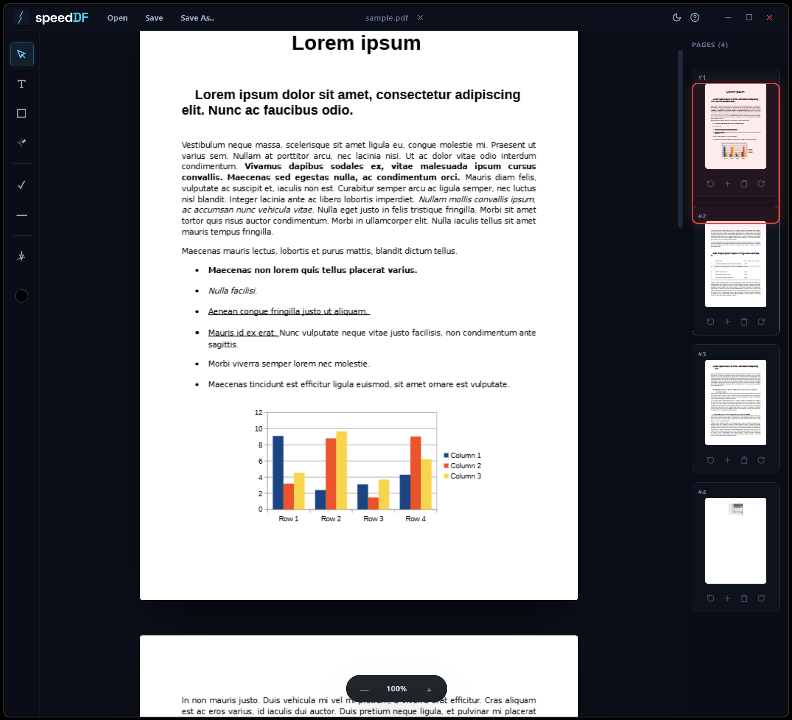

# speedDF <svg width="22" height="22" viewBox="0 0 512 512" xmlns="http://www.w3.org/2000/svg" style="display: inline-block; vertical-align: middle;">
  <defs>
    <linearGradient id="bg-grad" x1="0%" y1="0%" x2="100%" y2="100%">
      <stop offset="0%" stop-color="#0f172a" />
      <stop offset="100%" stop-color="#1a2744" />
    </linearGradient>
    <linearGradient id="bolt-grad" x1="0%" y1="0%" x2="100%" y2="100%">
      <stop offset="0%" stop-color="#38bdf8" />
      <stop offset="100%" stop-color="#06b6d4" />
    </linearGradient>
    <filter id="bolt-glow" x="-40%" y="-40%" width="180%" height="180%">
      <feGaussianBlur stdDeviation="8" result="blur" />
      <feMerge>
        <feMergeNode in="blur" />
        <feMergeNode in="SourceGraphic" />
      </feMerge>
    </filter>
    <filter id="glow-soft" x="-60%" y="-60%" width="220%" height="220%">
      <feGaussianBlur stdDeviation="18" result="blur" />
      <feMerge>
        <feMergeNode in="blur" />
      </feMerge>
    </filter>
  </defs>
  <rect x="0" y="0" width="512" height="512" rx="108" ry="108" fill="url(#bg-grad)" />
  <g opacity="0.28">
    <line x1="52" y1="218" x2="128" y2="218" stroke="#06b6d4" stroke-width="6" stroke-linecap="round" />
    <line x1="38" y1="244" x2="118" y2="244" stroke="#06b6d4" stroke-width="5" stroke-linecap="round" />
    <line x1="52" y1="270" x2="108" y2="270" stroke="#06b6d4" stroke-width="4" stroke-linecap="round" />
  </g>
  <g transform="translate(256, 264) rotate(-4) translate(-256, -264)">
    <polygon points="168,118 338,118 338,128 348,138 348,420 168,420" fill="#0a1628" opacity="0.5" transform="translate(8, 8)" />
    <polygon points="162,112 322,112 362,152 362,414 162,414" fill="#1e293b" />
    <polygon points="322,112 362,112 362,152" fill="#0f172a" />
    <polygon points="322,112 362,152 322,152" fill="#334155" />
    <line x1="190" y1="195" x2="330" y2="195" stroke="#334155" stroke-width="7" stroke-linecap="round" />
    <line x1="190" y1="218" x2="300" y2="218" stroke="#334155" stroke-width="7" stroke-linecap="round" />
    <line x1="190" y1="241" x2="315" y2="241" stroke="#334155" stroke-width="7" stroke-linecap="round" />
    <line x1="190" y1="315" x2="330" y2="315" stroke="#334155" stroke-width="6" stroke-linecap="round" />
    <line x1="190" y1="336" x2="280" y2="336" stroke="#334155" stroke-width="6" stroke-linecap="round" />
    <line x1="190" y1="357" x2="305" y2="357" stroke="#334155" stroke-width="6" stroke-linecap="round" />
  </g>
  <ellipse cx="278" cy="264" rx="68" ry="110" fill="#06b6d4" opacity="0.12" filter="url(#glow-soft)" />
  <g filter="url(#bolt-glow)">
    <polygon points="306,138 248,276 284,276 206,396 174,396 236,262 200,262 256,138" fill="url(#bolt-grad)" />
  </g>
  <polygon points="296,155 254,264 278,264 220,368 246,368 290,264 266,264 302,168" fill="#bae6fd" opacity="0.35" />
</svg>

A high-performance, light-weight desktop PDF editor and annotation engine. Built using Tauri v2, SvelteKit, TypeScript, and Rust, speedDF provides a fully localised workflow to sign, mark up, audit, and restructure PDF files with zero cloud latency and absolute data privacy.

---

## Key Features

### 1. Client-Side Vector Flattening Engine (pdf-lib)
Unlike standard web editors that merely slide floating HTML elements over a canvas view, speedDF features a built-in client compilation compiler. When exporting via Save As.., your text modifications, bounding rectangles, audit stamps, digital signatures, and freehand highlights are mathematically translated and baked permanently into the document's native binary vector tree. The pipeline automatically calculates coordinate transformations, flipping your front-end actions from top-left web space to the true bottom-left point origins required by the PDF specification.

### 2. Digital Ink Signature & Initial Profiles
* **Dual-Canvas Drafting Wizard:** Sketch custom signature and initial sets directly inside the tool window. Canvas paths utilise a high-fidelity, segment-by-segment interpolation matrix to perfectly track your pointer tip regardless of display size or layout scale.
* **Persistent Disk Memory:** Committed sign-offs are packed into Base64 PNG data URLs and securely mirrored into local disk storage memory, keeping your configurations safely cached across system reboots.
* **Sleek Template Management:** Activate stamps on click or clear them cleanly. Features an inline, custom Tailwind confirmation overlay allowing you to drop obsolete profiles out of memory permanently.

### 3. Transparent Ghost Previews & Alignment HUD
When selecting a signature or initial profile to drop onto a sheet, a 45% semi-transparent ghost replica of that specific stroke path instantly binds directly to your cursor crosshairs. This removes all positioning guesswork, letting you align signatures exactly to visual rule blocks before clicking to print a solid commit onto the canvas layer.

### 4. Smart Sizing Memory Caches (localStorage)
When dragging vector corner handles to resize structural stamps like Ticks (✓) or Dashes (—), their percentage dimensions are instantly captured to local disk memory. The tool automatically remembers your exact sizing choices, allowing you to establish the exact layout proportions for a form blueprint once, and stamp duplicate rows endlessly without resizing each time.

### 5. Resolution-Independent Freehand Highlighter
Draw a fluid, translucent yellow wash over any data text rows. Highlighter strokes are tracked as an array of raw mathematical percentage nodes ([{x, y}]) rather than heavy raster assets. They are rendered live via an isolated front-end SVG overlay utilising viewBox="0 0 100 100" and preserveAspectRatio="none", ensuring your markups stay crisp, vector-sharp, and un-blurred even when scaling document views.

### 6. Keyed Page Excision & Route Mapping
Page restructuring utilises strict immutable list reconciliation tracking loops ((pageNumber) keys) to handle structural operations. When you drop a page via the right sidebar trashcan icon, its specific index path is instantly filtered out of the global state tracking array. Svelte completely target-destroys the explicit DOM element, cleanly erasing it from the thumbnail track, the main scroll container view, and completely skipping its byte segments during final export packaging.

### 7. Native OS Shell Integration
* **Draggable Window Header:** Sleek custom border frame layout allowing smooth app window movements across the OS environment.
* **Centered Filename Tracking:** Passes packed payload structures across the asynchronous Tauri bridge on file loads to display your true physical filename string centered in the titlebar.
* **Unified Scroll Bar Aesthetics:** Standard browser scroll bars are globally overridden with a dark slate matching color path to match the high-contrast editor interface style.
* **Zoom HUD Controls:** Smooth viewport canvas adjustments ranging from 50% to 200% alongside target-view focus snapping.

---

## Architecture Blueprint

The editor splits system duties cleanly between low-level system memory commands and real-time reactive layout rendering updates:

[Backend Interface (lib.rs)] <--- IPC (Invoke) ---> [Frontend SvelteKit & PDF Pipeline]

* **rfd:** Asynchronous OS File Picker Dialog Windows
* **serde:** Serialisation Data Payload Mapping Bridges
* **pdf.js:** Renders high-res localised canvases for display layout
* **pdf-lib:** Calculates geometric point transformations & bakes bytes
* **lopdf (v0.41):** Automated Object Stream Decryption and background container stream evaluation
* **$state:** Svelte 5 Runes managing reactive tools and pageOrder routes

---

## Installation & Build Guide

### Prerequisites
Ensure your local system toolchains are updated and properly installed:
1. Node.js (v18+ recommended)
2. Rust Compiler & Cargo Toolchain (via rustup)
3. C++ Build Tools for Windows (via Visual Studio workloads)

### Dependency Installation
Clone your development branch workspace repository, change into the root folder directory path, and fetch your package allocations:
npm install

### Run Hot-Reload Dev Server
Launch your desktop interface container cycle live with hot-swapping module assets active:
npm run tauri dev

### Compiling Production Standalone Executables
To pack your completely optimised, self-contained desktop system binary executable package (speeddf.exe), run the build script:
npm run build:exe

The packed asset drops straight inside your project generation release target subdirectory:
src-tauri\target\release\speeddf.exe

---

## Unlocking Debugging DevTools inside Production

Because tracking component behaviors inside compiled shells is blind work, you can force Tauri to unlock Chrome DevTools inspect tools directly inside your standalone production releases.

1. Open src-tauri/Cargo.toml
2. Locate your tauri package dependency reference block under [dependencies]
3. Simply append the "devtools" flag directly into its active features array:
tauri = { version = "2.0.0", features = [ "codec", "image", "devtools" ] }

4. Recompile your build (npm run build:exe). You can now press F12 or right-click anywhere on the running app workspace to bring up the Web Console inspect screens live!

Alternatively, you can compile an unlocked diagnostic executable without editing text configuration sheets:
npx tauri build --debug

---

## Keyboard Shortcut Matrix

* **? / F1** : Toggles the operational system help control panel and licensing modal layout
* **Delete / Backspace** : Drops selected items (Select Mode)
* **Ctrl + Right Arrow** : Shifts active page orientation 90° Clockwise
* **Ctrl + Left Arrow** : Shifts active page orientation 90° Counter-Clockwise
* **F12** : Toggles Chrome DevTools Window (Unlocked Only)

---

## Development Roadmap
- [x] Persistent custom tool sizing caches.
- [x] Smooth freehand highlighting with translucent matrix bakes.
- [x] Clean Tailwind-styled delete prompt overlays.
- [x] Center-aligned native filename header regions.
- [x] Standard operational system shortcut layouts mapped directly to the F1 dashboard block.
- [x] Native Protected Stream Decryption core layer mapping using upgraded lopdf.
- [x] Implement multi-file backend stitching loops via + indicator commands (PDF Merge).
- [ ] Implement text annotation font-family variance sizing options.

---

## License
This project is open-source software and licensed under the terms of the MIT License.