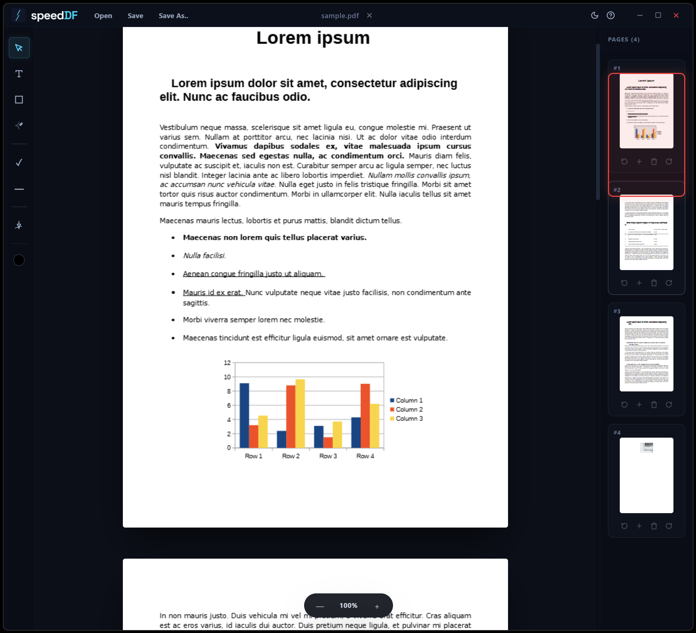

# speedDF


**A fast, local PDF editor and annotation app.**  
No cloud. No accounts. No ads. Open a file, mark it up, save — done.

Built with Tauri 2, SvelteKit, TypeScript, and Rust. Install size stays small; work stays on your machine.



---

## Why speedDF?

Most PDF tools are either bloated, subscription-gated, or send your documents somewhere else. speedDF is the opposite:

- **Fully local** — files never leave your PC
- **Fast to open** — designed for quick load and a responsive workspace
- **Lightweight** — small install; optional OCR models download only when you need them
- **Real exports** — annotations and form fills bake into the PDF, not a fragile overlay
- **Open source (MIT)** — free to use, inspect, and extend

If you just need to rotate a page, sign a form, highlight a clause, or merge a few PDFs without paying a monthly fee, this is for you.

---

## Features

### Annotate & mark up
- Text, freehand, highlighter, shapes, lines (with optional arrows)
- Signatures and initials (draw once, reuse)
- Stamps and common marks (tick, cross, etc.) with remembered sizes
- Multi-select, align, and batch style changes
- Real PDF text objects on export (selectable after save)

### Forms & links
- Fill existing AcroForm fields (text, checkbox, dropdown, signature)
- Clickable URI hyperlinks with a safe confirm-before-open flow
- Personal value memory (autocomplete for repeated form / text values — stays on your machine)

### Document structure
- Multi-tab workspace
- Rotate, reorder, delete, insert blank, and merge PDFs
- Bookmarks that write into the PDF outline catalog
- Comments / notes on pages
- Full-document find (`Ctrl+F` / `Cmd+F`)

### Images too
- Open PNG, JPG, TIFF, WebP, BMP
- Annotate and export
- Image resize (%, px, aspect locked)

### Extra tools
- Always-on-top Tools window: calculator, timer, stopwatch, scratch pad, Magic 8 Ball
- Dark and light themes
- Recent documents with thumbnails
- Optional offline OCR (models download on demand)

---

## Platforms

| Platform | Notes |
|----------|--------|
| **Windows** | Primary target; MSI / NSIS installers via GitHub Releases |
| **macOS** | Apple Silicon builds; Intel may need a local build on older machines |
| **Linux** | AppImage / deb via releases where CI provides them |

Download the latest release from the [Releases](https://github.com/57471C/speedDF/releases) page.

---

## Quick start (users)

1. Grab the installer for your OS from [Releases](https://github.com/57471C/speedDF/releases)
2. Install and open a PDF or image
3. Annotate, fill forms, reorder pages as needed
4. **Save** or **Save As…** — changes are written into the file

File associations can be set so double-click opens documents in speedDF.

---

## Build from source (developers)

**Prerequisites**
- Node.js 18+
- Rust (rustup)
- Platform build tools (e.g. Visual Studio C++ workload on Windows)

```bash
git clone https://github.com/57471C/speedDF.git
cd speedDF
npm install
npm run tauri dev          # development
npm run build:exe          # production binary (see src-tauri/target/release)
```
---

## Architecture (short)

| Layer | Role |
|-------|------|
| **SvelteKit UI** | Workspace, tools, multi-tab state, annotations |
| **pdf.js** | Page rendering and text layer |
| **pdf-lib** | Flatten annotations, forms, outlines into the PDF |
| **Tauri + Rust** | File I/O, dialogs, OCR pipeline, native shell |

Everything runs locally. Optional OCR models are fetched only when you use Extract Text, then cached.

For deeper module maps and edge-case notes, see `AGENT_MAP.md` and `ARCHITECTURE_NUANCES.md` in the repo.

---

## Privacy

- No telemetry by default
- No cloud accounts
- Documents are not uploaded
- Form/value memory and settings live in local storage / app data only

---

## Contributing

Issues and PRs are welcome. Prefer small, focused changes and keep `npm run check` clean.

If speedDF saves you time or money, a coffee via the project site is appreciated — it helps keep the lights on for a solo-maintained tool.

---

## License

MIT — see [LICENSE](./LICENSE).
